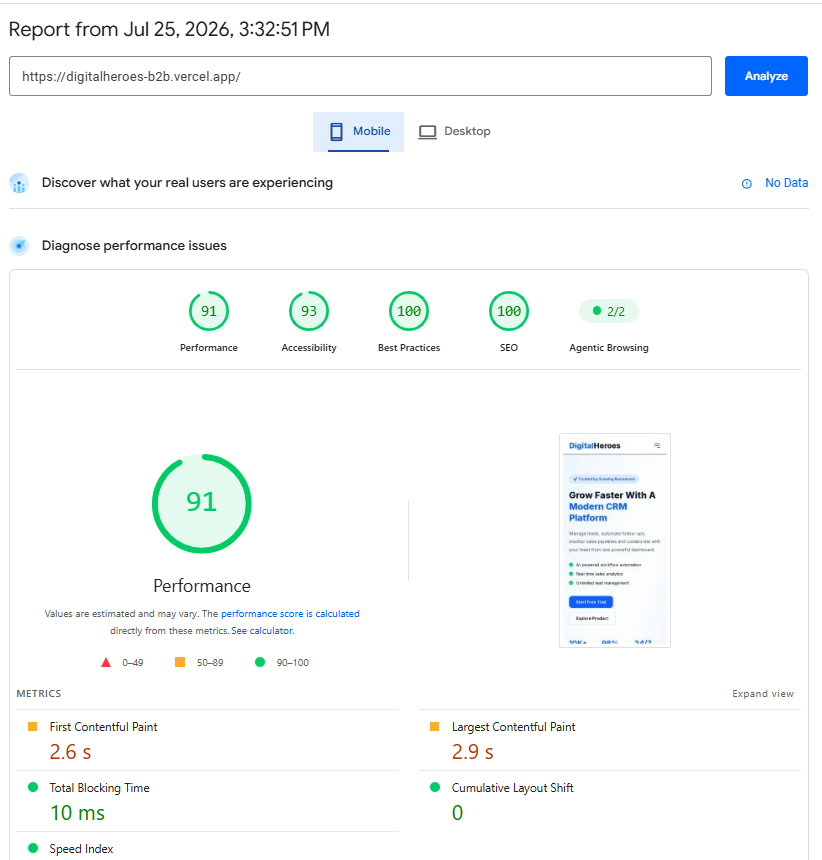
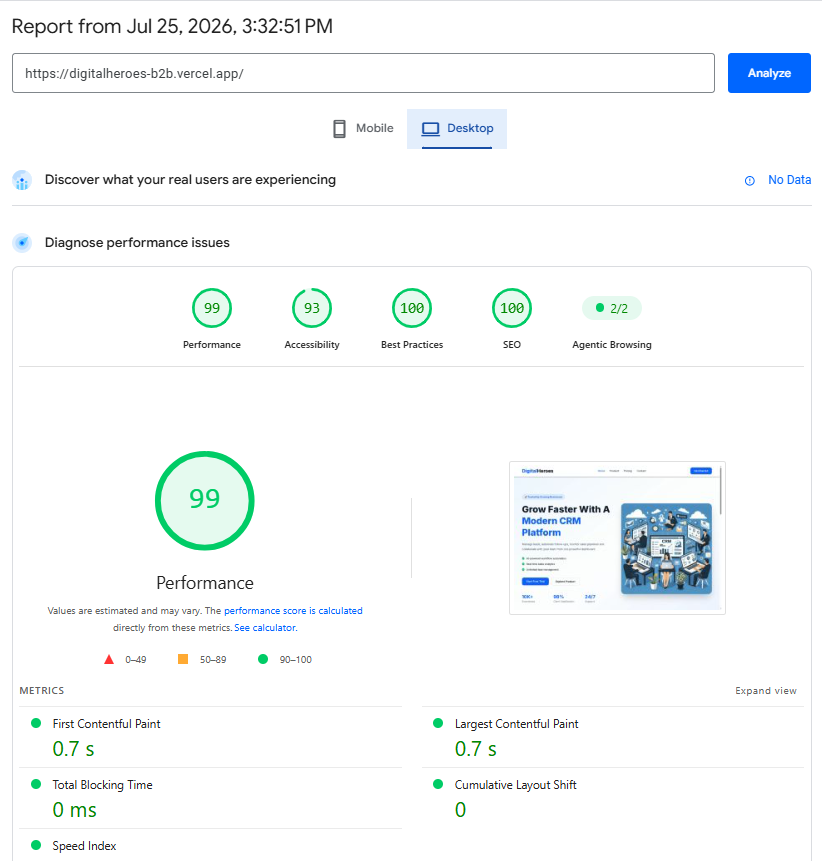
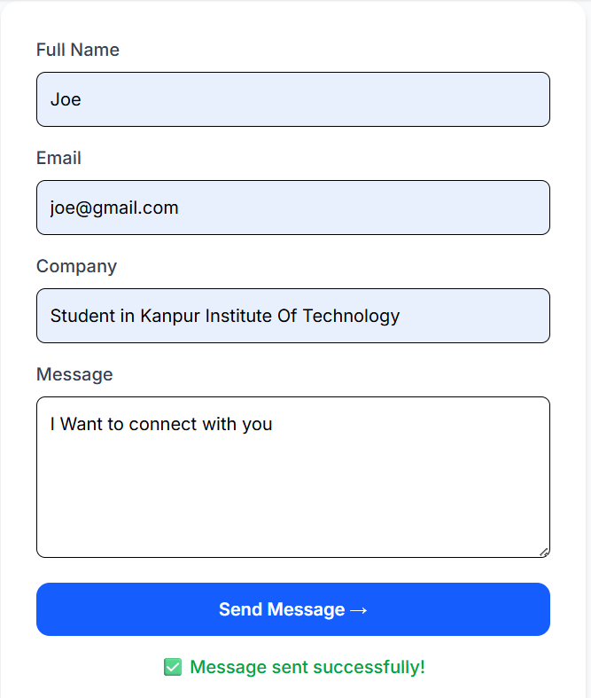
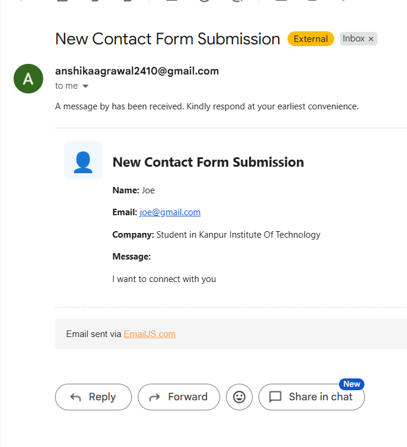

# 🚀 Modern CRM Landing Page


A modern and responsive CRM Landing Page built with React, Vite, and Tailwind CSS as part of the Digital Heroes Frontend Training Assignment. The project focuses on responsive design, SEO optimization, accessibility, smooth animations, and modern frontend development practices.


---

## 🌐 Live Project

[](YOUR_VERCEL_LINK)

[](YOUR_GITHUB_LINK)

---

## 📖 Project Overview

This project is a responsive CRM landing page featuring multiple sections designed to showcase a modern SaaS product.

The website includes:

- Home Page
- Product Section
- Pricing Section
- Contact Section
- Responsive Navigation
- Animated UI
- SEO Optimization
- Accessible Design

---

## ✨ Features

- Responsive Layout
- Modern UI Design
- React Router Navigation
- Framer Motion Animations
- Contact Form using EmailJS
- SEO Meta Tags
- Open Graph Tags
- JSON-LD Structured Data
- Semantic HTML
- Accessibility Improvements
- Mobile Friendly Design

---

## 🛠 Tech Stack

- React
- Vite
- Tailwind CSS
- React Router DOM
- Framer Motion
- React Helmet Async
- EmailJS
- HTML5
- CSS3
- JavaScript (ES6+)

---

## 📂 Project Structure

```text
crm-landing-page/
│
├── public/
│
├── src/
│   ├── assets/
│   ├── components/
│   │   ├── Navbar.jsx
│   │   ├── Hero.jsx
│   │   ├── Features.jsx
│   │   ├── Pricing.jsx
│   │   ├── Testimonials.jsx
│   │   ├── Contact.jsx
│   │   └── Footer.jsx
│   │
│   ├── pages/
│   │   ├── Home.jsx
│   │   ├── Product.jsx
│   │   ├── Pricing.jsx
│   │   └── Contact.jsx
│   │
│   ├── App.jsx
│   └── main.jsx
│
├── package.json
├── vite.config.js
└── README.md
```

---

## 🚀 Getting Started

### Clone Repository

```bash
git clone YOUR_GITHUB_LINK
```

### Navigate to Project

```bash
cd crm-landing-page
```

### Install Dependencies

```bash
npm install
```

### Run Development Server

```bash
npm run dev
```

### Build for Production

```bash
npm run build
```

---

## 📈 Lighthouse Highlights

- 🚀 Performance Optimized
- ♿ Accessibility Improved
- 🔍 SEO Optimized
- ✅ Best Practices Followed

---
## 📊 Lighthouse Report

The project was tested using **Google Lighthouse** to evaluate performance, accessibility, best practices, and SEO.

### 📱 Mobile

| Metric | Score |
|--------|------:|
| 🚀 Performance | **91** |
| ♿ Accessibility | **93** |
| ✅ Best Practices | **100** |
| 🔍 SEO | **100** |



---

### 🖥️ Desktop

| Metric | Score |
|--------|------:|
| 🚀 Performance | **99** |
| ♿ Accessibility | **93** |
| ✅ Best Practices | **100** |
| 🔍 SEO | **100** |



> **Note:** Lighthouse scores may vary slightly between runs depending on network conditions, browser environment, and Lighthouse version.

---

## 📨 EmailJS Integration

The contact form is fully functional and integrated with **EmailJS** for real-time email delivery.

- ✅ Client-side Form Validation
- ✅ Real-time Email Delivery
- ✅ No Backend Required

| Contact Form | Email Received |
|--------------|----------------|
|  |  |

---

## 🎯 Assignment Objectives

- Build a responsive CRM landing page
- Implement React Router navigation
- Add smooth animations using Framer Motion
- Integrate EmailJS contact form
- Improve SEO using React Helmet Async
- Add Open Graph & JSON-LD
- Ensure Accessibility compliance
- Follow modern frontend best practices

---

## 🙏 Acknowledgement

Built for the **Digital Heroes Frontend Training Task**.

🔗 https://digitalheroesco.com

---
## 📬 Connect With Me

If you have any questions, feedback, or suggestions regarding this project, feel free to reach out.

[](mailto:anshikaagrawal2410@gmail.com)
[](https://www.linkedin.com/in/contact-anshikaagrawal)
[](https://github.com/anshika2410-hub)

---

## 📄 License

This project is intended for educational purposes as part of the **Digital Heroes Frontend Training Assignment**.

---

## ⭐ Support the Project

If you found this project helpful or interesting, please consider giving it a ⭐ on GitHub. Your support is greatly appreciated!
